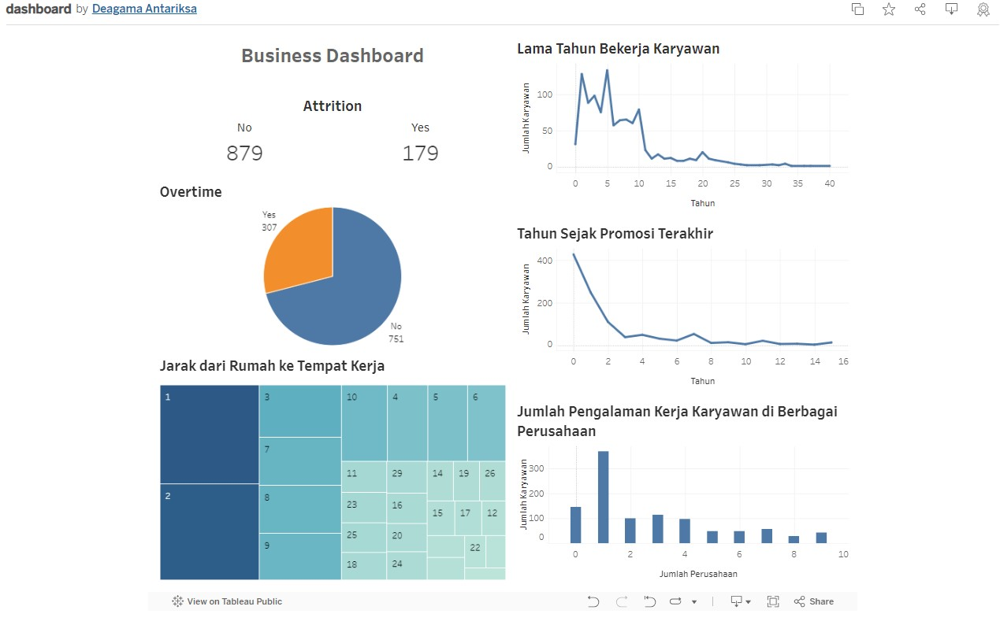

# Proyek Akhir: Menyelesaikan Permasalahan Perusahaan Edutech

## Business Understanding

Jaya Jaya Maju menghadapi tingginya tingkat turnover karyawan (attrition rate) yang melebihi 10%. Ini menjadi permasalahan serius yang dapat mengganggu produktivitas dan keseimbangan perusahaan. Karyawan adalah aset berharga, dan kehilangan mereka dapat menyebabkan biaya yang signifikan, serta mengganggu budaya perusahaan dan kinerja keseluruhan.

### Permasalahan Bisnis

Perusahaan Jaya Jaya Maju sedang menghadapi tingkat attrition yang tinggi, dengan rasio karyawan yang keluar melebihi 10%.

### Cakupan Proyek

1. Eksplorasi dan analisis data untuk mengidentifikasi faktor-faktor yang berpotensi mempengaruhi attrition rate.
2. Pembuatan business dashboard menggunakan Metabase untuk memvisualisasikan data dan memonitor faktor-faktor tersebut.
3. Kesimpulan dan rekomendasi berdasarkan analisis data.

### Persiapan

Sumber data: https://github.com/dicodingacademy/dicoding_dataset/tree/main/employee

### Setup environment:

pip install pandas
pip install numpy
pip install scikit-learn

## Business Dashboard

Berikut ini merupakan business dashboard yang telah dibuat menggunakan Tableau Public

untuk melihat dashboard dapat dilihat melalui link berikut: 
https://public.tableau.com/app/profile/deagama.antariksa/viz/dashboard_17159404400140/Dashboard2

# Penjelasan
Dashboard bisnis yang dibuat bertujuan untuk memantau dan menganalisis faktor-faktor yang mempengaruhi tingkat attrition (keluar masuknya karyawan) di perusahaan Jaya Jaya Maju. Berikut adalah penjelasan mengenai fitur-fitur yang terdapat pada dashboard tersebut:
1. Attrition (Pengunduran Diri)
Menunjukkan jumlah karyawan yang sudah mengundurkan diri (Yes) dan yang tidak (No). Ini memberi gambaran tentang tingkat turnover di perusahaan.
2. Overtime (Lembur)
Menampilkan jumlah karyawan yang melakukan lembur (Yes) dan yang tidak (No). Hal ini penting karena lembur dapat berhubungan dengan kepuasan kerja dan produktivitas.
3. Years at Company (Lama Bekerja di Perusahaan)
Menunjukkan berapa lama rata-rata karyawan telah bekerja di perusahaan. Ini dapat menyoroti stabilitas tenaga kerja dan potensi retensi.
4. Number of Companies Worked (Jumlah Perusahaan yang Pernah Dikerjakan)
Menggambarkan seberapa sering karyawan telah bekerja di perusahaan lain sebelumnya. Ini bisa menjadi indikator mobilitas karir dan pengalaman kerja.
5. Years Since Last Promotion (Tahun Sejak Promosi Terakhir)
Menunjukkan berapa lama sejak karyawan terakhir kali mendapatkan promosi. Ini penting untuk memahami perkembangan karir dan kepuasan karyawan.
6. Distance from Home (Jarak dari Rumah)
Menggambarkan seberapa jauh rata-rata karyawan tinggal dari tempat kerja mereka. Hal ini bisa mempengaruhi kepuasan kerja dan retensi.

## Conclusion

Berdasarkan hasil analisis regresi logistik terhadap data karyawan, berikut adalah faktor-faktor utama yang mempengaruhi tingginya tingkat attrisi di perusahaan:
1. Lembur (OverTime):
Fitur OverTime memiliki koefisien regresi tertinggi, yang menunjukkan bahwa karyawan yang sering melakukan lembur cenderung memiliki tingkat attrisi yang lebih tinggi. Hal ini mungkin disebabkan oleh kelelahan, stres, dan ketidakpuasan yang terkait dengan jam kerja yang panjang.
2. Lama Bekerja di Perusahaan (YearsAtCompany):
Karyawan dengan masa kerja yang lebih lama di perusahaan cenderung memiliki tingkat attrisi yang lebih rendah. Ini menunjukkan bahwa karyawan yang baru bergabung dengan perusahaan lebih rentan untuk keluar.
3. Jumlah Perusahaan yang Pernah Dikerjakan (NumCompaniesWorked):
Karyawan yang pernah bekerja di lebih banyak perusahaan cenderung memiliki tingkat attrisi yang lebih tinggi. Ini bisa mengindikasikan bahwa karyawan dengan pengalaman kerja yang lebih banyak memiliki kecenderungan untuk mencari peluang baru dan berpindah pekerjaan lebih sering.
4. Tahun Sejak Promosi Terakhir (YearsSinceLastPromotion):
Karyawan yang sudah lama tidak mendapatkan promosi cenderung memiliki tingkat attrisi yang lebih tinggi. Hal ini mungkin menunjukkan bahwa kurangnya kesempatan untuk kemajuan karir dapat menyebabkan ketidakpuasan dan keinginan untuk mencari peluang di tempat lain.
5. Jarak Rumah dari Tempat Kerja (DistanceFromHome):
Karyawan yang tinggal lebih jauh dari tempat kerja cenderung memiliki tingkat attrisi yang lebih tinggi. Jarak yang lebih jauh mungkin berkontribusi pada kelelahan, biaya transportasi yang tinggi, dan kurangnya keseimbangan antara kerja dan kehidupan pribadi.

### Rekomendasi Action Items (Optional)

Berikut beberapa rekomendasi action items yang dapat dipertimbangkan oleh perusahaan untuk mengurangi tingkat attrisi dan mencapai target mereka:
1. Program Manajemen OverTime
Implementasikan kebijakan yang lebih baik terkait manajemen lembur, seperti pengaturan batas maksimum lembur, insentif bagi karyawan yang bekerja fleksibel, atau revisi beban kerja untuk mengurangi kelelahan kerja.
2. Pengembangan Karir dan Promosi
Tingkatkan kesempatan untuk pengembangan karir dan promosi internal dengan program pelatihan, mentoring, dan evaluasi kinerja yang jelas. Ini dapat meningkatkan motivasi karyawan dan mempertahankan mereka dalam jangka panjang.
3. Program Retensi Karyawan
Sediakan insentif atau paket kompensasi tambahan bagi karyawan yang telah bekerja dalam waktu yang lama di perusahaan. Ini dapat meliputi bonus loyalty, tunjangan khusus, atau kesempatan untuk berpartisipasi dalam proyek-proyek strategis.
4. Evaluasi Kebijakan Mobilitas Karyawan
Tinjau kebijakan terkait kompensasi atau fasilitas bagi karyawan yang harus bekerja dari jarak yang jauh. Pertimbangkan opsi seperti fleksibilitas jadwal kerja, bantuan transportasi, atau fasilitas perumahan bagi karyawan yang harus melakukan perjalanan jauh.
5. Survey Kepuasan Karyawan dan Tindak Lanjut
Lakukan survei secara berkala untuk mengukur tingkat kepuasan karyawan dan alasan di balik attrisi. Ambil tindakan proaktif berdasarkan hasil survei untuk meningkatkan lingkungan kerja dan pengalaman karyawan.
6. Komitmen Terhadap Keseimbangan Kerja-Hidup
Implementasikan program atau kebijakan yang mendukung keseimbangan kerja-hidup, seperti fleksibilitas jam kerja, cuti tambahan, atau fasilitas kesehatan mental. Keseimbangan ini dapat membantu meningkatkan produktivitas dan kesejahteraan karyawan.
7. Peningkatan Komunikasi dan Keterlibatan
Tingkatkan komunikasi dua arah antara manajemen dan karyawan untuk memfasilitasi penghargaan atas kontribusi karyawan, serta memberikan umpan balik yang konstruktif. Ini dapat meningkatkan keterlibatan karyawan dan kepercayaan terhadap kepemimpinan perusahaan.
